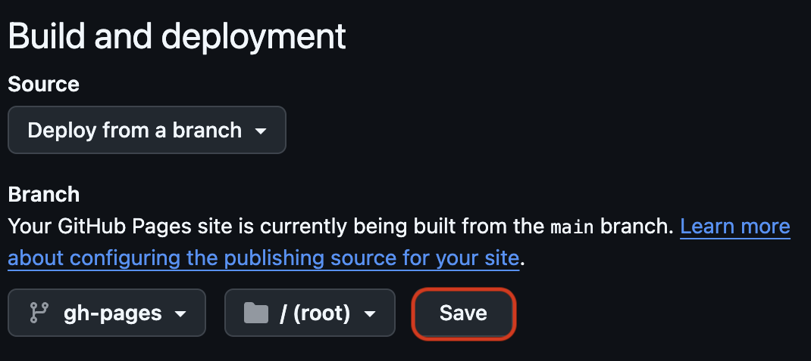

# **Introduction**
## **Background Information**
This guide will walk through the process of deploying a **React + Vite** web application to GitHub Pages, a task commonly encountered by software developers, frontend engineers, and students working on web-based projects. Deploying a React + Vite app is useful for showcasing portfolio projects, sharing interactive web applications, and testing web designs.

## **Context of Use**
- **For Developers:** Useful for quick prototyping and sharing React applications.
- **For Students:** Helps in publishing academic or portfolio projects without the need for paid hosting.
- **Common Challenges:** Users may face issues related to incorrect configurations, missing dependencies, or incorrect repository setup.

---
# **Requirements**
Before starting, ensure you have the following tools installed and configured on your system.

## **Hardware Requirements:**
- A computer (Windows, macOS, or Linux)
- Stable internet connection

## **Software Requirements:**
1. **Node.js (LTS version)** – Required to run JavaScript applications.
   - Download from: [https://nodejs.org/en/download](https://nodejs.org/en/download)
2. **Git** – Required for version control and pushing code to GitHub.
   - Download from: [https://git-scm.com/downloads](https://git-scm.com/downloads)
3. **GitHub Account** – Needed to create a repository and host the project.
   - Sign up at: [https://github.com](https://github.com)
4. **Code Editor (Recommended: VS Code)** – To code and edit your project.
   - Download from: [https://code.visualstudio.com/Download/](https://code.visualstudio.com/Download)

---
# **Safety Considerations**
- Be cautious when running commands in the terminal to avoid accidental file deletions.
- Ensure that you are working inside the correct directory before executing Git commands.
- Avoid committing sensitive data (e.g., API keys, credentials) to public repositories.
- Regularly update dependencies to prevent security vulnerabilities.

---
# **Step-by-Step Instructions**

## **Step 1: Set Up a React + Vite Project**
1. Open a terminal or command prompt.
2. Navigate to the directory where you want to create the project.
```sh
cd path/to/your/repo
```
3. Run the following command to create a new Vite project:
   ```sh
   # Replace <your-project-name> with your desired project name
   npm create vite@latest <your-project-name> -- --template react 
   ```
4. Navigate into the project directory:
   ```sh
   cd <your-project-name>
   ```
5. Install project dependencies:
   ```sh
   npm install
   ```

## **Step 2: Create a GitHub Repository**
1. Go to GitHub and log in.
2. Click on New Repository.

   


3. Enter a repository name (e.g., \<your-repo-name\>).
4. Choose Public (or Private if you have GitHub Pro).
5. Do not initialize with a README, .gitignore, or license (these will be added later).
6. Click Create Repository.

   


## **Step 3: Configure Vite for GitHub Pages**
1. Open `vite.config.js` in a code editor.
2. Add the following `base` property to the configuration:
   ```js
   import { defineConfig } from 'vite';
   import react from '@vitejs/plugin-react';

   export default defineConfig({
     plugins: [react()],
     base: '/<your-repo-name>/', // Replace <your-repo-name> with your actual GitHub repository name
   });
   ```

## **Step 4: Modify package.json for Deployment**
1. Open `package.json`.
2. Add this line to the top-level of the file:
   ```json
   "homepage": "https://<your-username>.github.io/<your-repo-name>/",
   ```
2. Add the following scripts inside the `scripts` section:
   ```json
   "predeploy": "npm run build",
   "deploy": "gh-pages -d dist"
   ```
   Below is an example of how your the `package.json` file should look after modification:

   ```json
   {
      "name": "my-vite-app",
      "private": true,
      "version": "0.0.0",
      "type": "module",
      "homepage": "https://anushnandyala.github.io/my-vite-app/", 
      "scripts": {
         "dev": "vite",
         "build": "vite build",
         "lint": "eslint .",
         "preview": "vite preview",
         "predeploy": "npm run build",
         "deploy": "gh-pages -d dist"
      },
      "dependencies": {
         "react": "^19.0.0",
         "react-dom": "^19.0.0"
      },
      "devDependencies": {
         "@eslint/js": "^9.21.0",
         "@types/react": "^19.0.10",
         "@types/react-dom": "^19.0.4",
         "@vitejs/plugin-react": "^4.3.4",
         "eslint": "^9.21.0",
         "eslint-plugin-react-hooks": "^5.1.0",
         "eslint-plugin-react-refresh": "^0.4.19",
         "gh-pages": "^6.3.0",
         "globals": "^15.15.0",
         "vite": "^6.2.0"
      }
   }
   ```

3. Run the following command to install the GitHub Pages package:
   ```sh
   npm install gh-pages --save-dev
   ```

## **Step 5: Initialize Git and Push the Project to GitHub**
1. Initialize a Git repository:
   ```sh
   git init
   ```
2. Add the remote GitHub repository:
   ```sh
   git remote add origin https://github.com/<your-username>/<your-repo-name>.git
   ```
3. Commit and push the code:
   ```sh
   git add .
   git commit -m "Initial commit"
   git branch -M main
   git push -u origin main
   ```
4. Go to `https://github.com/<your-username>/<your-repo-name>` to see your Vite app on GitHub.

   

## **Step 6: Deploy the App to GitHub Pages**
1. Run the deployment script:
   ```sh
   npm run deploy
   ```
   This builds the project and pushes the `dist/` folder to the `gh-pages` branch.

## **Step 7: Enable GitHub Pages**
1. Navigate to your **GitHub repository** at `https://github.com/<your-username>/<your-repo-name>`.

   

2. Go to **Settings > Pages**.

   

3. Under **Branch**, select `gh-pages` and click **Save**.

   

4. Your site will be available at:
   ```
   https://<your-username>.github.io/<your-repo-name>/
   ```

   

---
# **Conclusion & Further Resources**
You have successfully deployed a **React + Vite** app to **GitHub Pages**! If you encounter issues, here are some additional resources:
- [Vite Documentation](https://vitejs.dev/guide/)
- [GitHub Pages Documentation](https://pages.github.com/)
- [GitHub CLI Documentation](https://cli.github.com/)

For accessibility and further assistance, check **GitHub Discussions** or **Stack Overflow** for troubleshooting common errors.

---
# **References**
- Node.js. (n.d.). Retrieved from [https://nodejs.org/](https://nodejs.org/)
- Git. (n.d.). Retrieved from [https://git-scm.com/](https://git-scm.com/)
- GitHub CLI. (n.d.). Retrieved from [https://cli.github.com/](https://cli.github.com/)
- Vite. (n.d.). Retrieved from [https://vitejs.dev/](https://vitejs.dev/)

